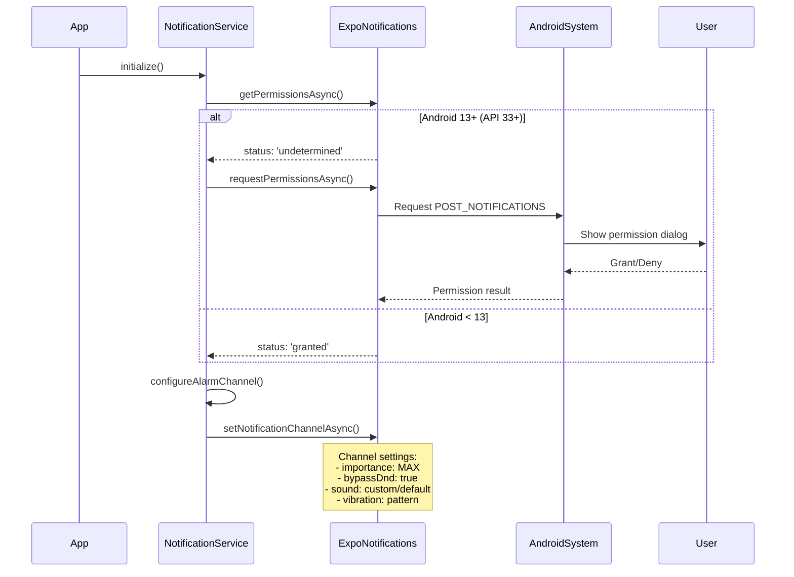
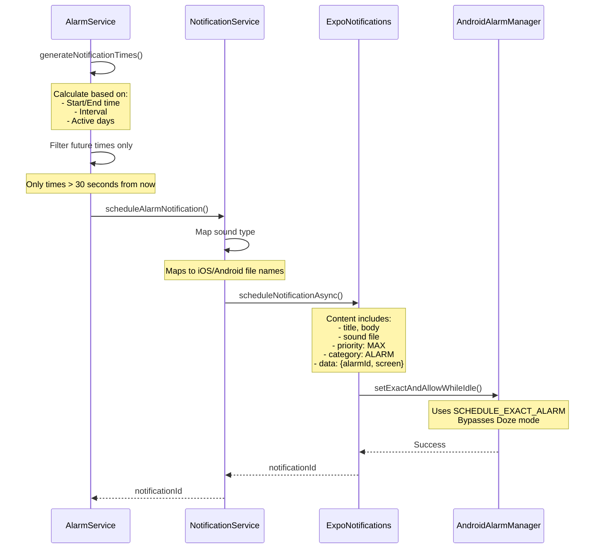
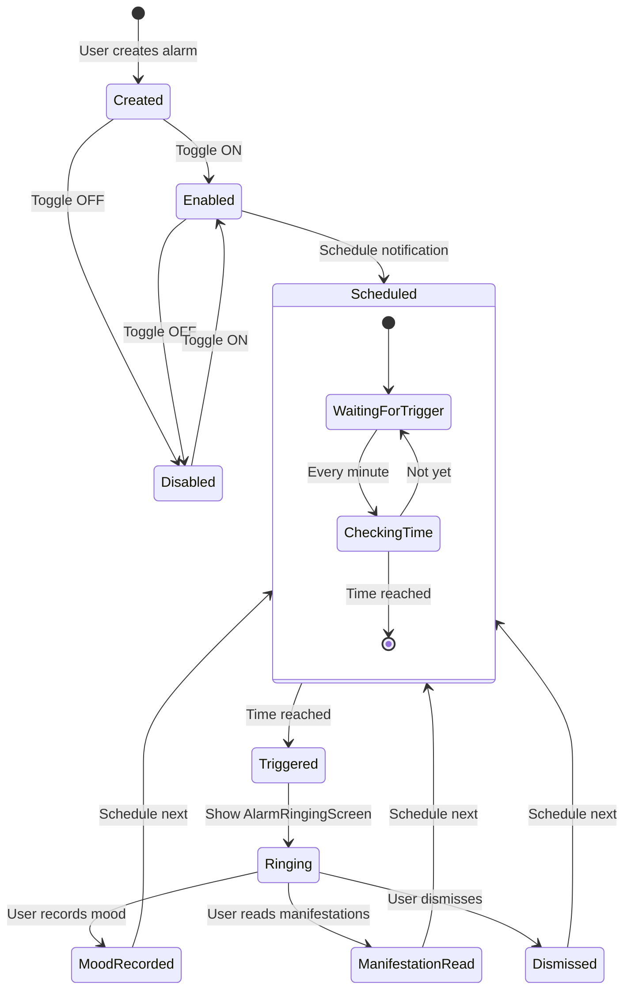
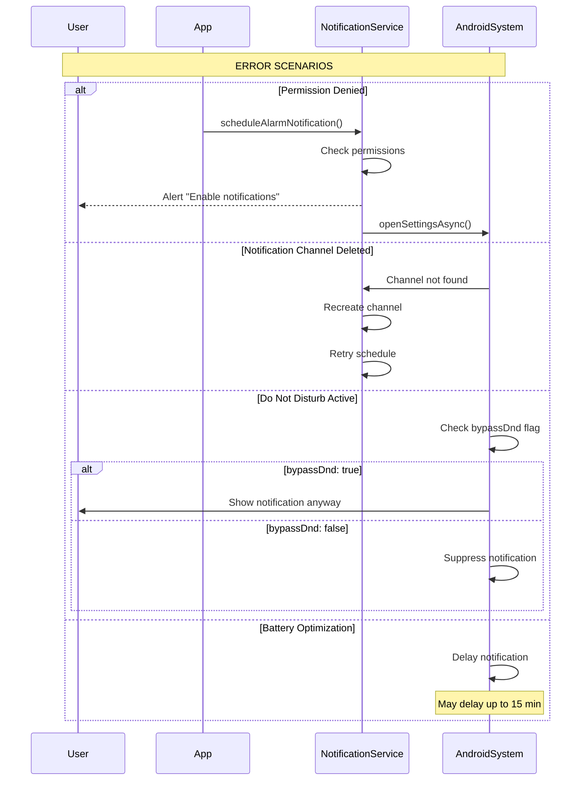

# Alarm System Sequence Diagram

## Complete Alarm Flow

```mermaid
sequenceDiagram
    participant User
    participant AlarmSetupScreen
    participant AlarmService
    participant StorageService
    participant NotificationService
    participant ExpoNotifications
    participant AndroidSystem
    participant AlarmRingingScreen
    participant MoodRecordingScreen
    participant ManifestationReadingScreen

    %% Alarm Creation Flow
    Note over User,AlarmSetupScreen: 1. ALARM CREATION
    User->>AlarmSetupScreen: Creates new alarm
    AlarmSetupScreen->>AlarmSetupScreen: Set name, time, interval, days
    AlarmSetupScreen->>AlarmSetupScreen: Select sound type
    User->>AlarmSetupScreen: Save alarm
    
    AlarmSetupScreen->>AlarmService: saveAlarm(alarm)
    AlarmService->>StorageService: saveAlarm(alarm)
    StorageService->>StorageService: Store in AsyncStorage
    StorageService-->>AlarmService: Success
    
    alt Alarm is Enabled
        AlarmService->>AlarmService: updateAlarmNextTrigger(alarmId)
        AlarmService->>AlarmService: Calculate next trigger time
        AlarmService->>AlarmService: scheduleAlarmNotifications(alarm)
        
        Note over AlarmService: CRITICAL: Only schedules ONE notification
        AlarmService->>NotificationService: cancelAllNotifications()
        NotificationService->>ExpoNotifications: cancelAllScheduledNotificationsAsync()
        
        AlarmService->>AlarmService: generateNotificationTimes()
        AlarmService->>NotificationService: scheduleAlarmNotification()
        
        NotificationService->>NotificationService: requestNotificationPermissions()
        NotificationService->>ExpoNotifications: getPermissionsAsync()
        
        alt Permissions not granted
            NotificationService->>ExpoNotifications: requestPermissionsAsync()
            ExpoNotifications->>AndroidSystem: Request POST_NOTIFICATIONS
            AndroidSystem-->>User: Permission Dialog
            User-->>AndroidSystem: Grant/Deny
            AndroidSystem-->>ExpoNotifications: Permission Result
        end
        
        NotificationService->>NotificationService: configureAlarmChannel()
        NotificationService->>ExpoNotifications: setNotificationChannelAsync('alarm_channel')
        Note over ExpoNotifications: Channel with MAX importance, bypassDnd: true
        
        NotificationService->>NotificationService: Map sound type to file
        NotificationService->>ExpoNotifications: scheduleNotificationAsync()
        ExpoNotifications->>AndroidSystem: Schedule with AlarmManager
        Note over AndroidSystem: Uses SCHEDULE_EXACT_ALARM permission
        
        AndroidSystem-->>ExpoNotifications: notificationId
        ExpoNotifications-->>NotificationService: notificationId
        NotificationService-->>AlarmService: notificationId
        
        AlarmService->>StorageService: updateAlarm(nextTrigger)
    end
    
    AlarmService-->>AlarmSetupScreen: Success
    AlarmSetupScreen-->>User: Alarm created

    %% Alarm Triggering Flow
    Note over AndroidSystem,AlarmRingingScreen: 2. ALARM TRIGGERING
    
    AndroidSystem->>AndroidSystem: Alarm time reached
    AndroidSystem->>AndroidSystem: Wake device (WAKE_LOCK)
    AndroidSystem->>ExpoNotifications: Trigger notification
    ExpoNotifications->>ExpoNotifications: setNotificationHandler
    Note over ExpoNotifications: shouldPlaySound: true, shouldShowAlert: true
    
    alt App in Foreground
        ExpoNotifications->>NotificationService: notificationReceivedListener
        NotificationService->>NotificationService: handleAlarmTriggered()
        NotificationService->>AlarmRingingScreen: Navigate
    else App in Background/Killed
        ExpoNotifications->>AndroidSystem: Show notification
        AndroidSystem->>AndroidSystem: Play sound
        AndroidSystem->>AndroidSystem: Vibrate pattern
        AndroidSystem->>User: Display notification
        
        User->>AndroidSystem: Tap notification
        AndroidSystem->>ExpoNotifications: Notification response
        ExpoNotifications->>NotificationService: notificationResponseReceivedListener
        NotificationService->>AlarmRingingScreen: Navigate with params
    end

    %% Alarm Ringing Screen Flow
    Note over AlarmRingingScreen,ManifestationReadingScreen: 3. USER RESPONSE
    
    AlarmRingingScreen->>AlarmRingingScreen: Show alarm UI
    AlarmRingingScreen->>AlarmRingingScreen: Play alarm sound
    AlarmRingingScreen->>AlarmRingingScreen: Start vibration
    AlarmRingingScreen->>AlarmService: recordAlarmTrigger(alarmId)
    AlarmService->>StorageService: updateAlarm(lastTriggered)
    AlarmService->>AlarmService: updateAlarmNextTrigger()
    AlarmService->>AlarmService: scheduleAlarmNotifications()
    Note over AlarmService: Schedule NEXT single notification
    
    alt User chooses Record Mood
        User->>AlarmRingingScreen: Tap "Record Mood"
        AlarmRingingScreen->>AlarmRingingScreen: Stop sound & vibration
        AlarmRingingScreen->>MoodRecordingScreen: Navigate with alarmId
        MoodRecordingScreen->>User: Show mood recording UI
        User->>MoodRecordingScreen: Record mood
        MoodRecordingScreen->>StorageService: Save mood entry
    else User chooses Read Manifestations
        User->>AlarmRingingScreen: Tap "Read Manifestations"
        AlarmRingingScreen->>AlarmRingingScreen: Stop sound & vibration
        AlarmRingingScreen->>ManifestationReadingScreen: Navigate
        ManifestationReadingScreen->>StorageService: Get manifestations
        ManifestationReadingScreen->>User: Display manifestations
    else User dismisses
        User->>AlarmRingingScreen: Tap "Dismiss"
        AlarmRingingScreen->>AlarmRingingScreen: Stop sound & vibration
        AlarmRingingScreen->>User: Return to previous screen
    end

    %% Background Alarm Refresh Flow
    Note over AlarmService,AndroidSystem: 4. ALARM REFRESH/RESCHEDULE
    
    AlarmService->>AlarmService: refreshAllAlarms()
    AlarmService->>NotificationService: cancelAllNotifications()
    loop For each active alarm
        AlarmService->>AlarmService: scheduleAlarmNotifications(alarm)
        AlarmService->>NotificationService: scheduleAlarmNotification()
        NotificationService->>ExpoNotifications: scheduleNotificationAsync()
    end
    
    Note over AlarmService: Safety check: Max 50 notifications total
```

## Key Components

### 1. **Permission Flow**

### 2. **Notification Scheduling Detail**

### 3. **Alarm State Management**

## Critical Implementation Details

1. **Single Notification Strategy**: Only ONE notification is scheduled at a time to prevent spam
2. **Permission Requirements**: 
   - `POST_NOTIFICATIONS` (Android 13+)
   - `SCHEDULE_EXACT_ALARM` (Android 12+)
   - `USE_FULL_SCREEN_INTENT` (for wake screen)
3. **Notification Channel**: High importance with bypass DND for alarm behavior
4. **Sound Handling**: Custom sounds mapped differently for iOS/Android
5. **Navigation Flow**: Notification → AlarmRinging → Mood/Manifestation screens
6. **Auto-reschedule**: After each trigger, the next notification is scheduled

## Error Handling Paths

